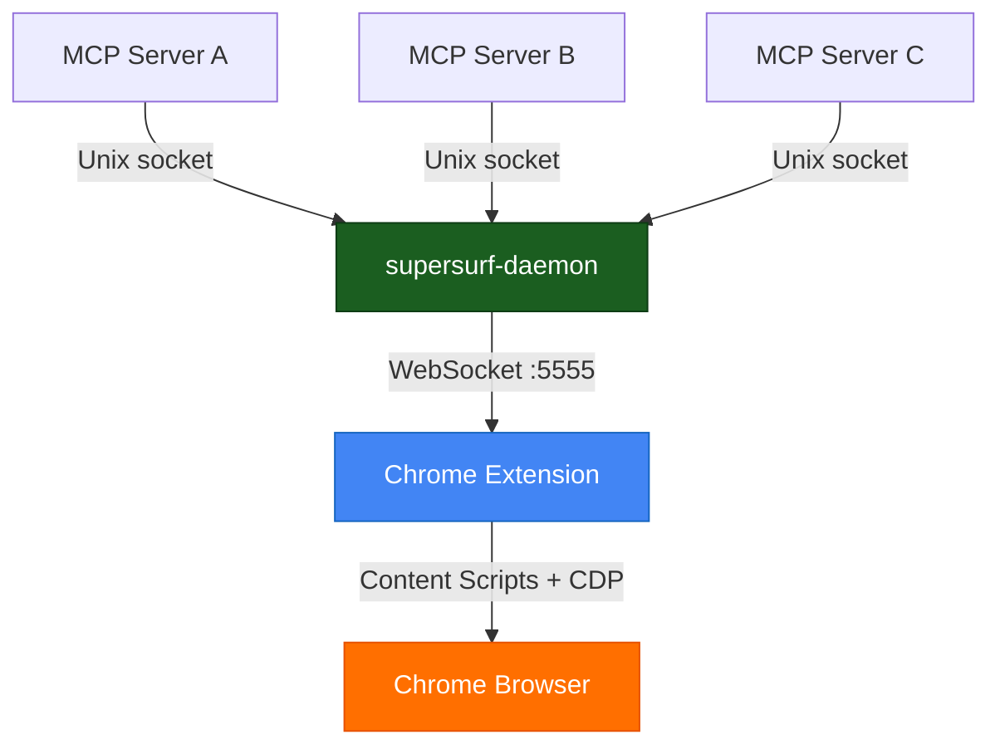

# supersurf-daemon

Multiplexer for SuperSurf — coordinates multiple MCP sessions sharing one Chrome extension connection.

**You don't install or configure this.** The MCP server ([`supersurf-mcp`](https://www.npmjs.com/package/supersurf-mcp)) automatically spawns the daemon when an agent calls `connect`. If a daemon is already running, it connects to the existing instance instead — no duplicate processes, no wasted memory.

## Architecture

The daemon owns the single WebSocket connection to the Chrome extension. MCP servers connect to it over a Unix domain socket (`~/.supersurf/daemon.sock`). Tool calls are scheduled round-robin across sessions, with tab ownership enforcement — sessions can't touch each other's tabs.

## Lifecycle

- **Auto-spawned** by the MCP server on `connect` via `npx supersurf-daemon@latest`
- **Single instance** — detects an existing daemon via PID file and skips spawning
- **Stays alive** when sessions disconnect, keeping the extension connection warm
- **Idle timeout** — exits after 10 minutes with no connected sessions

## Protocol

1. MCP server connects to `~/.supersurf/daemon.sock`
2. Sends `{ type: "session_register", sessionId: "..." }\n`
3. Daemon responds `{ type: "session_ack", browser: "Chrome", buildTimestamp: "..." }\n`
4. Post-handshake: NDJSON (newline-delimited JSON-RPC 2.0) for tool calls

## License

Apache-2.0 with Commons Clause.
